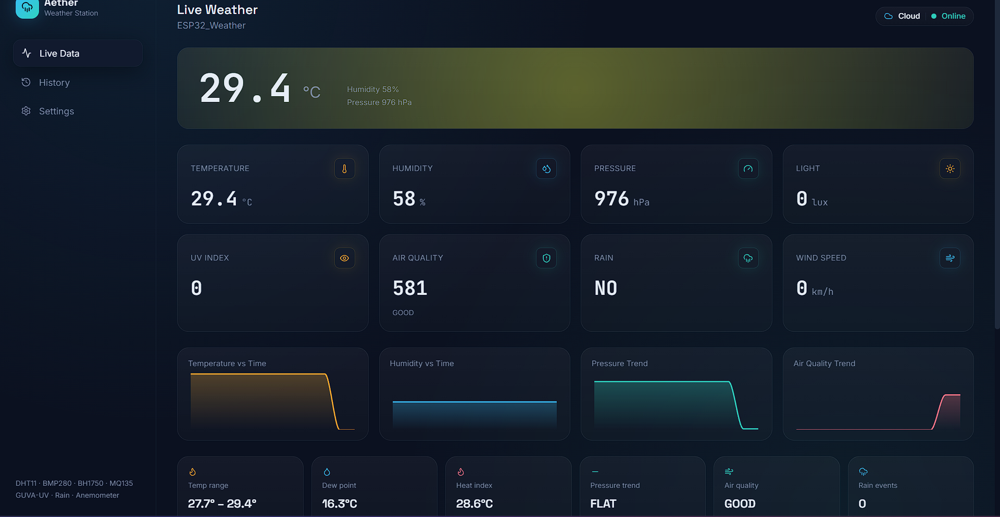
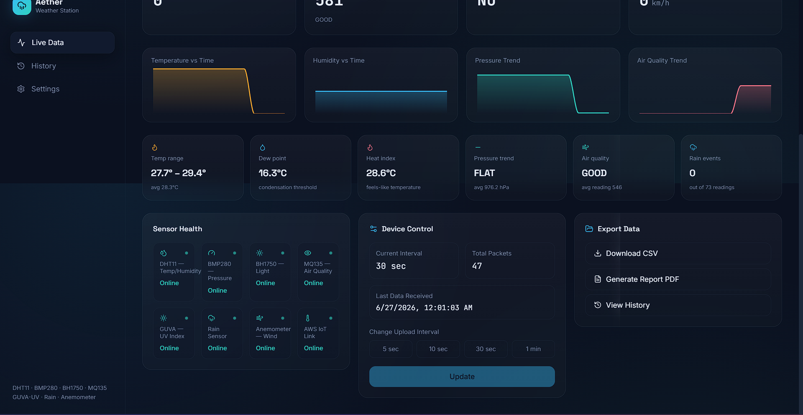
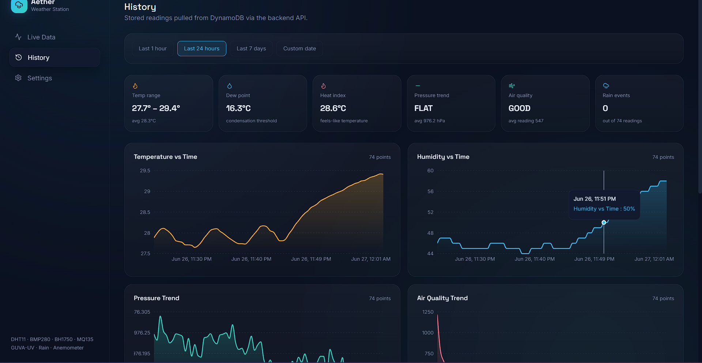
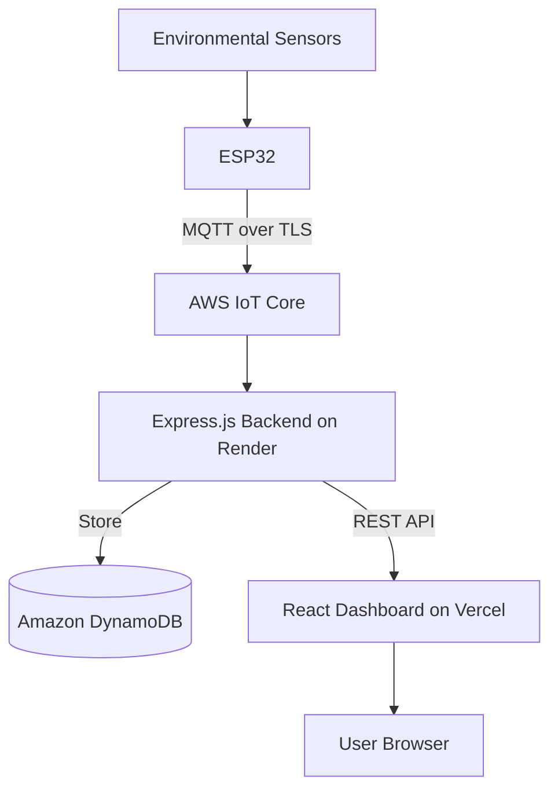
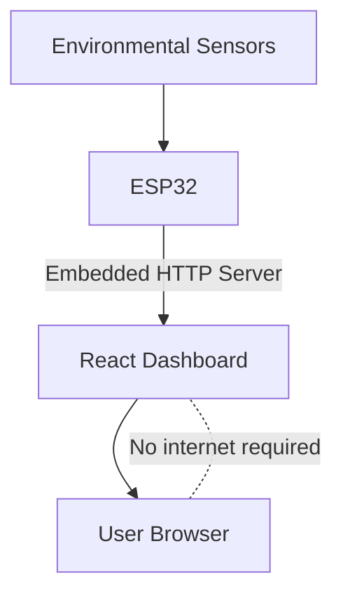

<div align="center">

# 🌦️ Aether Weather Station

### Intelligent Cloud-Based IoT Weather Monitoring & Analytics Platform


**Real-time environmental monitoring with dual connectivity (Cloud + Local), historical analytics, remote device control, and a professional web dashboard.**

[Overview](#-overview) • [Screenshots](#-dashboard-preview) • [Features](#-features) • [Architecture](#%EF%B8%8F-system-architecture) • [Hardware](#-hardware-components) • [Tech Stack](#-software-stack) • [API](#-rest-api-reference) • [Deployment](#-deployment) • [Roadmap](#-future-enhancements)

</div>

---

## 📌 Overview

**Aether Weather Station** is a professional full-stack IoT platform that monitors environmental conditions in real time using an **ESP32** microcontroller paired with seven environmental sensors. Sensor data is securely published to **AWS IoT Core** over MQTT, persisted in **Amazon DynamoDB**, and visualized through a modern, responsive **React** dashboard.

The system supports two independent communication paths:

- **☁️ Cloud Mode** — accessible from anywhere in the world via AWS, with full historical analytics
- **📡 Local Mode** — direct ESP32-to-dashboard communication over the same Wi-Fi network, with no internet dependency

This makes Aether equally useful for remote, long-term monitoring and for fast, low-latency on-site readings — covering the complete IoT pipeline from sensor acquisition to cloud storage to data visualization.

---

## 📸 Dashboard Preview

**Live Weather** — real-time readings across all eight environmental metrics, with live trend graphs for temperature, humidity, pressure, and air quality.



**Sensor Health & Device Control** — per-sensor online status, upload-interval control, and one-click CSV/PDF export.



**Historical Analytics** — DynamoDB-backed history with selectable time ranges and interactive charts.



---

## 🎯 Objectives

- Measure environmental conditions in real time across 7 sensor types
- Securely publish readings to the cloud using MQTT over TLS
- Persist historical weather data for long-term analysis
- Visualize live and historical data through interactive graphs
- Enable remote monitoring from anywhere via AWS
- Enable direct local monitoring without internet access
- Support remote configuration and control of the ESP32
- Deliver a complete, production-ready, end-to-end IoT solution

---

## ✨ Features

### ☁️ Cloud Mode
- AWS IoT Core integration with MQTT over TLS
- Persistent storage of every reading in DynamoDB
- Historical weather data and analytics
- Remote monitoring from anywhere
- Live device connection status

### 📡 Local Mode
- Direct ESP32 ↔ dashboard communication
- No internet required
- Operates over the same local Wi-Fi network
- Low-latency live updates

### 📊 Dashboard
- Live readings: temperature, humidity, pressure, light, UV index, air quality, rain, wind speed
- Trend graphs for temperature, humidity, pressure, and air quality
- Per-sensor health/online status monitoring
- Historical data viewer
- CSV export
- PDF report generation

### ⚙️ Device Control
- Remotely change the sensor upload interval
- Monitor device connectivity (online/offline)
- Switch between Cloud Mode and Local Mode
- Track total packets received and last packet timestamp

---

## 🛠 Hardware Components

| Component | Type | Measures |
|---|---|---|
| **ESP32 DevKit V1** | Microcontroller | Core processing, Wi-Fi, MQTT |
| **DHT11** | Sensor | Temperature, Humidity |
| **BMP280** | Sensor | Atmospheric Pressure |
| **BH1750** | Sensor | Ambient Light Intensity (Lux) |
| **GUVA UV Sensor** | Sensor | UV Index |
| **MQ135** | Sensor | Air Quality, Smoke, Polluting Gases |
| **Rain Sensor** | Sensor | Rainfall Detection |
| **Anemometer** | Sensor | Wind Speed |

---

## 💻 Software Stack

| Layer | Technologies |
|---|---|
| **Embedded** | Arduino IDE, ESP32 Framework, C++ |
| **Frontend** | React, Vite, JavaScript, Chart.js, CSS |
| **Backend** | Node.js, Express.js, REST APIs, MQTT Client, AWS SDK |
| **Cloud** | AWS IoT Core, Amazon DynamoDB, IAM, MQTT over TLS |
| **Deployment** | Vercel (Frontend), Render (Backend) |

---

## 🏗️ System Architecture

### Cloud Mode Data Flow



### Local Mode Data Flow



**Working Principle:** the ESP32 continuously reads all connected sensors and, at a configurable interval, builds a JSON packet such as:

```json
{
  "temperature": 29.6,
  "humidity": 59,
  "pressure": 975,
  "light": 0,
  "uv": 0,
  "air_quality": 589,
  "rain": 0,
  "wind_speed": 0
}
```

This packet is simultaneously published to AWS IoT Core (Cloud Mode) and served from the ESP32's built-in HTTP server (Local Mode).

---

## 📁 Project Structure

```
Aether-Weather-Station/
├── backend/
│   ├── src/              # Express server, MQTT subscriber, DynamoDB integration
│   ├── certs/            # AWS IoT certificates & private keys
│   └── package.json
│
├── esp32/
│   └── WeatherStation.ino   # Sensor drivers, Wi-Fi, MQTT client, local HTTP server
│
├── frontend/
│   ├── src/               # React dashboard, graphs, settings, history, export
│   ├── public/
│   └── package.json
│
└── README.md
```

---

## 📡 REST API Reference

| Method | Endpoint | Description |
|---|---|---|
| `GET` | `/` | Health check |
| `GET` | `/api/live` | Returns the latest sensor reading |
| `GET` | `/api/history` | Returns historical weather records |
| `POST` | `/api/control` | Updates ESP32 upload interval remotely |
| `GET` | `/api/export/csv` | Downloads weather data as CSV |
| `GET` | `/api/export/pdf` | Downloads a generated PDF weather report |

---

## 🚀 Deployment

| Component | Platform |
|---|---|
| **Frontend** | [Vercel](https://vercel.com) |
| **Backend** | [Render](https://render.com) |
| **Cloud Services** | AWS IoT Core, Amazon DynamoDB |

The backend is publicly accessible over HTTPS; the frontend is hosted separately and communicates with it through REST APIs.

---

## 🔒 Security

- MQTT communication secured over TLS
- AWS IoT Core device authentication via certificates and private keys
- IAM policies for least-privilege backend access
- HTTPS-only backend APIs
- Environment variables for all secrets/credentials
- CORS protection on the API layer

---

## 🌍 Real-World Applications

Smart Agriculture • Weather Monitoring Stations • Environmental Research • Smart Cities • Industrial Safety • Greenhouses • University Laboratories • Air Quality Monitoring • Disaster Monitoring • Climate Research

---

## 🧠 Technical Skills Demonstrated

Embedded Systems (ESP32) · IoT System Design · Sensor Interfacing · MQTT Protocol · AWS IoT Core · Amazon DynamoDB · Node.js & Express.js · REST API Development · React & Vite · Cloud Deployment (Render & Vercel) · Real-Time Data Visualization · Cloud Security & Device Authentication

---

## 🔮 Future Enhancements

- [ ] AI-based weather prediction
- [ ] Machine learning environmental insights
- [ ] Mobile application
- [ ] Push notifications
- [ ] OTA firmware updates
- [ ] GPS integration
- [ ] Solar power & battery health monitoring
- [ ] Multi-device dashboard support
- [ ] User authentication & role-based access
- [ ] Map integration for multiple station locations

---

## 👨‍💻 Author

**Vishnu Varman**
Electronics & Communication Engineering Student

*Interests:* Embedded Systems · Internet of Things (IoT) · Cloud Computing · Full Stack Development · Artificial Intelligence · AWS Services

[](https://github.com/vishnuv41)

---

## 📄 License

This project is licensed under the **MIT License**.

---

## ⭐ Support

Aether Weather Station integrates embedded hardware, secure cloud communication, database management, backend API development, and a modern web interface into a single, production-ready IoT platform.

If you found this project useful, please consider giving it a ⭐ on GitHub!
